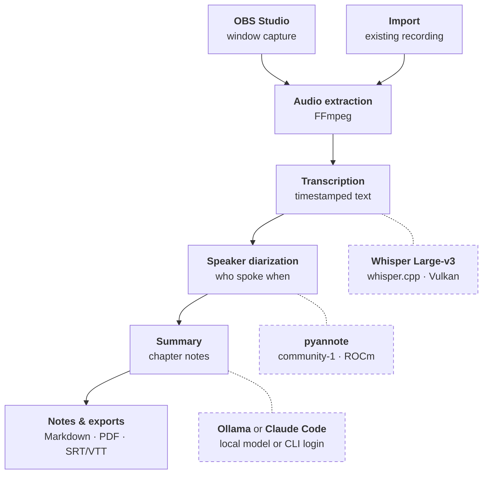

<p align="center">
  
</p>

<h1 align="center">SessionScribe</h1>

<p align="center">
  Record lectures and meetings, transcribe them on your own GPU, and turn
  them into structured, evidence-linked notes.
</p>

## What It Does

1. **Capture with OBS.** SessionScribe drives OBS Studio over its WebSocket
   API and records the selected lecture or meeting window. Existing
   recordings can be imported instead.
2. **Transcribe locally with Whisper.** Whisper Large-v3 runs in a managed
   `whisper.cpp` container on the GPU through Vulkan; no API key and no
   upload.
3. **Tell speakers apart.** In meetings, pyannote runs locally on ROCm and
   labels who spoke when, so summaries can assign action items per person.
4. **Summarize with a local Ollama model or Claude Code.** Lectures become
   chapter-structured study notes, meetings become decisions and action
   items; every statement links back to the transcript. Ollama keeps
   everything on the machine; Claude Code reuses its existing login and
   sends the transcript to Anthropic.



Solid arrows are the durable processing pipeline inside SessionScribe; dashed
boxes are the backends each stage calls. With Ollama for summaries, the whole
pipeline runs locally. Cloud providers (ElevenLabs, OpenAI-compatible
endpoints) can be used for transcription and summaries instead, but none is
required.

> [!IMPORTANT]
> **This is a private project.** I built SessionScribe to transcribe my own
> lectures on my own hardware, and I publish the source in case it is useful to
> someone else. It is not a product: there are no releases, no support
> commitment, and no guarantee that it runs on any system other than the one
> described below. **SessionScribe is currently Linux only.**

## Status

| Aspect       | State                                                                                                   |
| ------------ | ------------------------------------------------------------------------------------------------------- |
| Maturity     | Pre-1.0, used day to day by the author. Expect rough edges; open work is tracked in [TODO.md](TODO.md). |
| Platform     | Linux x86-64 only. Windows code paths exist but are neither built in CI, used, nor supported.           |
| Releases     | None. Build from source (see [Building from source](#building-from-source)).                            |
| Code signing | None. Locally built packages are unsigned.                                                              |
| Support      | Best effort. Issues are read; fixes are prioritised by what the author's own setup needs.               |

## Reference System

SessionScribe is developed and tested on exactly one machine. Anything that
deviates from it — in particular a non-AMD GPU or a different distribution —
is untested.

| Component          | Configuration                                                      |
| ------------------ | ------------------------------------------------------------------ |
| Operating system   | openSUSE Tumbleweed, KDE Plasma (Wayland)                          |
| GPU                | AMD Radeon RX 9070 XT (RDNA 4, `gfx1201`, 16 GB VRAM)              |
| Transcription      | Managed Whisper Large-v3, `whisper.cpp` Vulkan container           |
| Speaker separation | Managed pyannote `speaker-diarization-community-1`, ROCm container |
| Container runtime  | Docker Engine from the openSUSE repositories                       |
| Recording          | OBS Studio 32.x with the WebSocket server enabled                  |

Both managed runtimes fit into 16 GB of VRAM concurrently (Whisper Large-v3
plus roughly 2 GB for diarization), and each releases its VRAM after five
minutes of inactivity.

## Features

- **Recording.** Controls a user-installed OBS Studio over its local WebSocket
  API. Supports X11 window capture and the user-driven Wayland PipeWire portal;
  the portal's consent dialog is never bypassed.
- **Import.** Processes existing audio and video when no recording is needed.
- **Local transcription.** Deploys and supervises Whisper Large-v3 on Vulkan
  through a pinned, sandboxed `whisper.cpp` container; no API key required.
- **Local speaker identification.** Labels who spoke when in meetings through
  pyannote on ROCm, feeding per-person action items into meeting summaries.
- **Provider freedom.** Alternatively ElevenLabs Scribe, OpenAI-compatible
  endpoints, a local transcription CLI, Ollama, or a locally installed agent
  CLI for summaries. Model IDs and endpoint URLs are free text.
- **Lecture notes.** Summarises in the spoken language and structures lectures
  into chapters with key points, emphasis, open questions, a glossary, and
  study questions with answers. Every statement is grounded in transcript
  evidence.
- **Transcript-only sessions.** Summaries can be generated later from the
  stored transcript without transcribing again.
- **Revisions.** Transcript and summary revisions are preserved, including
  speaker rename/merge and manual edits.
- **Export.** Study notes as Markdown or PDF; transcripts as Markdown,
  speaker-labelled plain text, canonical JSON, SRT, and VTT.

## Screenshots

Screenshots will follow in a future update. They will show the main window,
the chapter-structured notes of a lecture, and the managed runtime cards in
Settings.

## Requirements

Mandatory:

- Linux x86-64.
- Node.js 24 and npm (see `.nvmrc`).
- FFmpeg and FFprobe on `PATH` for development builds; packaged builds bundle
  them.

Depending on the features used:

| Feature                    | Additional requirement                                                                                          |
| -------------------------- | --------------------------------------------------------------------------------------------------------------- |
| Recording                  | OBS Studio 32.x, **Tools → WebSocket Server Settings** enabled with a password                                  |
| Managed Whisper            | Vulkan-capable GPU under `/dev/dri`, Docker usable by the desktop user without `sudo`, ≥ 6 GiB free disk space  |
| Managed speaker separation | AMD GPU with ROCm access through `/dev/kfd`, the same Docker access, roughly 50 GB free for the container image |
| Cloud providers            | An API key for the selected provider, entered in the application                                                |

SessionScribe never requests administrator privileges. Rootless Docker is
preferred; membership in the `docker` group grants root-equivalent control.
On openSUSE Tumbleweed the base packages are:

```bash
sudo zypper install docker vulkan-tools
sudo systemctl enable --now docker
```

## Building from Source

```bash
git clone https://github.com/JanMrt-d/SessionScribe.git
cd SessionScribe
npm ci
npm run dev            # run the application in development mode
```

To produce an installable, unsigned x86-64 AppImage and RPM together with
`release/SHA256SUMS`:

```bash
npm run package:linux
```

The package bundles FFmpeg/FFprobe but deliberately excludes Docker, the
container images, and the model weights. Those are downloaded, pinned by
digest or SHA-256, and verified on first setup inside the application.

## Usage

1. Start SessionScribe. For recording, enter the OBS WebSocket password.
2. Optional: open **Settings → Local Whisper** and select **Set up Whisper**;
   for meetings also **Settings → Speaker identification**. Setup creates a
   ready-to-use transcription profile.
3. Create a lecture or meeting session, or import an existing recording, and
   select the transcription and summary profiles. **No summary — transcript
   only** is a valid choice.
4. Record the window. After stopping, the durable processing pipeline extracts
   the audio, transcribes, optionally identifies speakers, and summarises.
   Interrupted stages resume after a restart.
5. Review, edit, and export the transcript and notes.

## Documentation

| Document                                                         | Content                                                                         |
| ---------------------------------------------------------------- | ------------------------------------------------------------------------------- |
| [docs/managed-whisper.md](docs/managed-whisper.md)               | Host prerequisites, pinned assets, VRAM lifecycle, container boundary, recovery |
| [docs/speaker-identification.md](docs/speaker-identification.md) | ROCm diarization runtime, setup, and pipeline behaviour                         |
| [docs/providers.md](docs/providers.md)                           | Provider profiles, credential storage, endpoint rules, and shipped presets      |
| [ARCHITECTURE.md](ARCHITECTURE.md)                               | Durable pipeline, OBS recording lifecycle, process boundaries, security model   |
| [TODO.md](TODO.md)                                               | Open work                                                                       |

## Data Layout

The database, encrypted secrets, and managed model files live in Electron's
`userData` directory (`${XDG_CONFIG_HOME:-$HOME/.config}/session-scribe/`).
Recordings and review media live under:

```text
<Videos>/SessionScribe/<session-id>/
```

Recordings, transcript revisions, and summary revisions remain until the
session is deleted. Temporary extracted audio, provider chunks, and raw
provider responses are removed after successful processing.

## Privacy

There is no SessionScribe account, backend, telemetry, or cloud storage. With
the managed local runtimes, audio and transcripts never leave the machine.
Selecting a cloud profile sends the required media or transcript to that
profile's configured endpoint; the active provider is always visible before
processing.

Provider calls are cancellable and persisted stages resume after restart. A
remote request interrupted before its result is durably saved may be repeated,
because compatible APIs share no idempotency contract; that can incur another
provider charge.

Recording lectures or meetings may require the consent of the speakers and
participants, and lecture material may be subject to copyright. Compliance
with the applicable law and institutional rules is the user's responsibility.

## Contributing

Issues and pull requests are welcome, but please keep the scope of this
project in mind: it is maintained for one person's setup, and changes that
mainly serve other platforms or hardware may not be merged.
[CONTRIBUTING.md](CONTRIBUTING.md) covers the setup, the process boundaries a
change is reviewed against, and the verification gates.

Security problems go through [SECURITY.md](SECURITY.md) rather than a public
issue.

## License

[MIT](LICENSE).

Packages built from this repository bundle separate FFmpeg and FFprobe
executables and can download container images and model weights on request.
Those remain independent programs and assets under their own licenses — see
[THIRD_PARTY_NOTICES.md](THIRD_PARTY_NOTICES.md).
